# **Python ka Chilla 2023** 
## (Data Science with Python in 40-days)
- [**Python ka Chilla 2023**](#python-ka-chilla-2023)
  - [(Data Science with Python in 40-days)](#data-science-with-python-in-40-days)
  - [**Resources, Books and Blogs Links:**](#resources-books-and-blogs-links)
  - [**Day-1**](#day-1)
  - [**Day-2**](#day-2)
    - [**How to use VScode (an IDE) for Python?**](#how-to-use-vscode-an-ide-for-python)
  - [**Day-3**](#day-3)
    - [**Basics of Python programming for Data Science (1/2)**](#basics-of-python-programming-for-data-science-12)
  - [**Day-4**](#day-4)
    - [**Basics of Python programming for Data Science (2/2)**](#basics-of-python-programming-for-data-science-22)
  - [**Day-5**](#day-5)
    - [**Jupyternotebook Introduction, Libraries and Data Visualization**](#jupyternotebook-introduction-libraries-and-data-visualization)
    - [**Markdown Language in 75 Minutes (This video is taken from Python ka chilla 2022**](#markdown-language-in-75-minutes-this-video-is-taken-from-python-ka-chilla-2022)
  - [**Day-6**](#day-6)
    - [**Pandas\_01**](#pandas_01)
  - [**Day-7**](#day-7)
    - [**Pandas library basic functions**](#pandas-library-basic-functions)
  - [**Day-8**](#day-8)
    - [**Pandas tips and tricks**](#pandas-tips-and-tricks)
  - [**Day-9**](#day-9)
    - [**Pandas practice online**](#pandas-practice-online)
  - [**Day-10**](#day-10)
    - [**Data Wrangling and Data Visualization (Basics)**](#data-wrangling-and-data-visualization-basics)
  - [**Day-11**](#day-11)
    - [**Data Visualization**](#data-visualization)
  - [**Day-12**](#day-12)
    - [**Exploratory Data Analysis (Basics)**](#exploratory-data-analysis-basics)
  - [**Day-13**](#day-13)
    - [**Exploratory Data Analysis (A-Z)**](#exploratory-data-analysis-a-z)
  - [**Day-14**](#day-14)
    - [**ABC of Statistics**](#abc-of-statistics)
  - [**Day-15**](#day-15)
    - [**Python Data Wrangling Techniques: From Beginner to Pro**](#python-data-wrangling-techniques-from-beginner-to-pro)
  - [**Day-16**](#day-16)
    - [**Machine Learning Basics**](#machine-learning-basics)
  - [**Day-17**](#day-17)
    - [**Machine Learning Basics-1**](#machine-learning-basics-1)
  - [**Day-18**](#day-18)
    - [**Regression (Machine Learning Basics-2)**](#regression-machine-learning-basics-2)
  - [**Day-19**](#day-19)
    - [**Classification (Machine Learning Basics-3)**](#classification-machine-learning-basics-3)
  - [**Day-20**](#day-20)
    - [**How to select a best Model in Machine learning with Scikit-learn?**](#how-to-select-a-best-model-in-machine-learning-with-scikit-learn)
  - [**Day-21**](#day-21)
    - [**How to select a best parameters in a Machine learning model with Scikit-learn?**](#how-to-select-a-best-parameters-in-a-machine-learning-model-with-scikit-learn)
  - [**Day-22**](#day-22)
    - [**Machine learning terminologies and theoratical concepts (Part-1)**](#machine-learning-terminologies-and-theoratical-concepts-part-1)
  - [**Day-23**](#day-23)
    - [**Machine learning terminologies and theoratical concepts (Part-2)**](#machine-learning-terminologies-and-theoratical-concepts-part-2)
  - [**Day-24**](#day-24)
    - [**How to save and re-use a model**](#how-to-save-and-re-use-a-model)
  - [**Day-25**](#day-25)
    - [**Practice session individual**](#practice-session-individual)
  - [**Day-26**](#day-26)
    - [**How to use Conda environments?**](#how-to-use-conda-environments)
  - [**Day-27**](#day-27)
    - [**Machine Learning with Tensorflow**](#machine-learning-with-tensorflow)
  - [**Day-28**](#day-28)
    - [**neural Networks introduction**](#neural-networks-introduction)
  - [**Day-29**](#day-29)
    - [**Computer Vision in PYTHON**](#computer-vision-in-python)
  - [**Day-30**](#day-30)
    - [**Image Classification in Tensorflow**](#image-classification-in-tensorflow)
  - [**Day-31**](#day-31)
    - [**Machine learning and Activation function in Tensorflow**](#machine-learning-and-activation-function-in-tensorflow)
  - [**Day-32**](#day-32)
    - [**Crash course on Activation Functions**](#crash-course-on-activation-functions)
  - [**Day-33**](#day-33)
    - [**Project based learning**](#project-based-learning)
      - [**What is tensorflow fasion mnist dataset?**](#what-is-tensorflow-fasion-mnist-dataset)
  - [**Day-34**](#day-34)
    - [**How many epocs should we run in a deep neural network?**](#how-many-epocs-should-we-run-in-a-deep-neural-network)
  - [**Day-35**](#day-35)
    - [**Types of Neural Networks**](#types-of-neural-networks)
  - [**Day-36**](#day-36)
    - [**Streamlit Dashboards for Data Science**](#streamlit-dashboards-for-data-science)
  - [**Day-37**](#day-37)
    - [**Time Series Analysis**](#time-series-analysis)
  - [**Day-38**](#day-38)
    - [**Introduction to NLP and text classification**](#introduction-to-nlp-and-text-classification)
  - [**Day-39**](#day-39)
    - [**github and git tools**](#github-and-git-tools)
  - [**Day-40**](#day-40)
    - [**Use of chatGPT to maintain your social media accounts**](#use-of-chatgpt-to-maintain-your-social-media-accounts)
  - [**Feedback**](#feedback)
- [Information about the instructor:](#information-about-the-instructor)

---
- [What will you learn (Course Content)](#course-content)
<!-- - [How to register for this course](#registration) -->
<!-- - [How to take screen shots and send assignments](#how-to-take-screenshots-and-send-us-your-assignments)
- [How to take your phone as webcam and mic for meetings](#how-to-use-your-mobile-iphoneandroid-camera-as-webcam-and-mobile-mic-as-main-mic-for-zoom-meetings) -->
- [Important Resources, Books and Blogs](#resources-books-and-blogs-links)
- [Your Feedback matters](#feedback)

> An online course via zoom and youtube in Urdu/Hindi Language.
> 
This repository contains whole material of 40 days course on Python for Data Science in Urdu/Hindi 2023 Details are here: Registration details of our course is given [here](https://www.facebook.com/groups/codanics/permalink/1837695129921140/)           
<!-- ## **Registration**
You can register for this course from 01.01.2023-09.02.2023.\
More details on the course can be found in this [google form](https://forms.gle/kDyUnD1nrN2LF6qy8)

<!-- 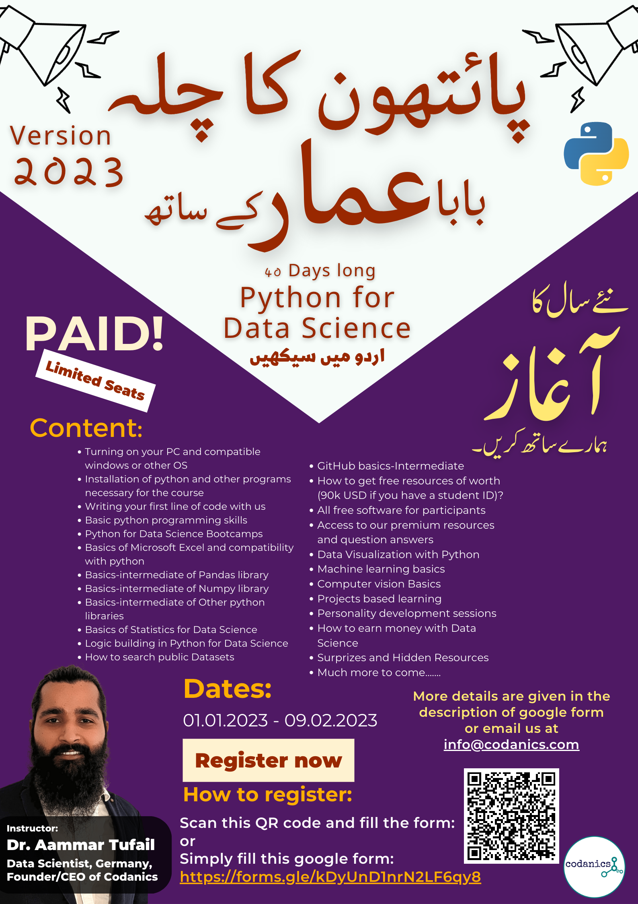 --> 
<!--  -->
<!-- 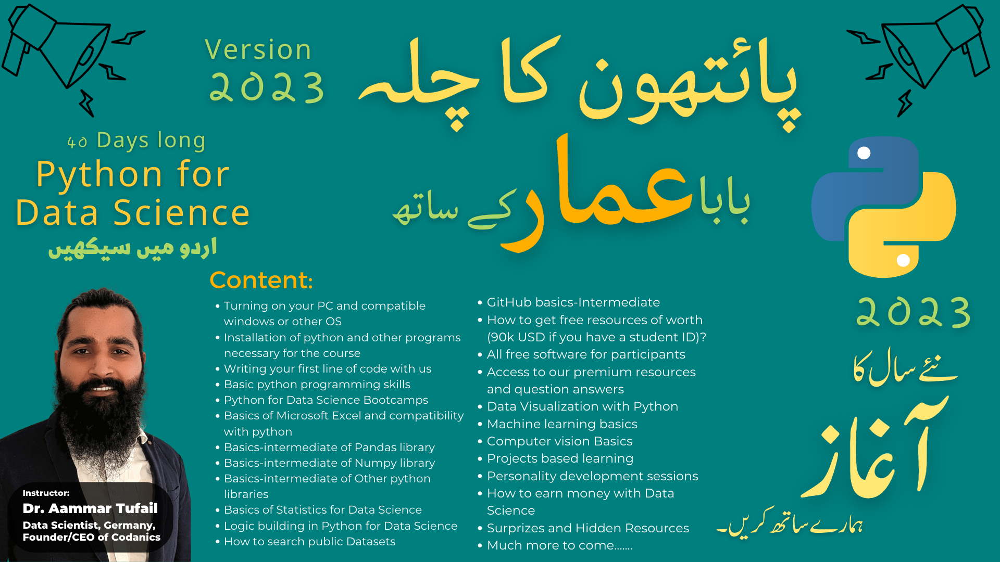

## **How to use your mobile (Iphone/Android) camera as webcam and mobile mic as main mic for zoom meetings**
Apnay mobile ka cameray ko as webcam use karnay k liay is [link](https://www.youtube.com/watch?v=IEmAQbvadE8&list=PL9XvIvvVL50Fba7psesg6ynQXdipw-yoN&index=5) per click kar k short video ko dekhen
Ye steps follow karen:
1. Install iriun software on your PC/Laptop from this [link](https://iriun.com/)
2. Same app ko [google](https://play.google.com/store/apps/details?id=com.jacksoftw.webcam&pcampaignid=MKT-Other-global-all-co-prtnr-py-PartBadge-Mar2515-1) ya [apple](https://itunes.apple.com/us/app/iriun-webcam-for-pc-and-mac/id1439303579?mt=8) k app store se download karen
3. Confirm the installation of apps in both devices your PC and Mobile
4. Dono devices ko connect karen, with a cable, ya phir ap same wifi se connect karen tu show ho jayen ge.
5. Open you zoom and select IRIUN camera as webcam in video/camera settings
6. Select audio settings and choose IRIUN as you mic as well for better sound quality.
7. For more details watch [this video for IPHONE](https://www.youtube.com/watch?v=nnbu3C1ht9Y&t=14s&ab_channel=VideoLane) and [this for android](https://www.youtube.com/watch?v=SsxBcGJDRC0&ab_channel=CapTrongNam-HowTo).
8. Join our zoom meetings and enjoy.  

## **How to take screenshots and send us your assignments**
Only for Windows 11 Windows 10

**Open Snipping Tool and take a screenshot** 
### *To use the Snipping Tool when you have a mouse and a keyboard:*
2. Press Windows logo key + Shift + S. The desktop will darken while you select an area for your screenshot.
3. Rectangular mode is selected by default. You can change the shape of your snip by choosing one of the following options in the toolbar: Rectangular mode, Window mode, Full-screen mode, and Free-form mode.
4. The screenshot is automatically copied to your clipboard. A notification also appears once you're finished taking a screenshot, select it for more editing options.

### *To use the Snipping Tool with only a mouse:*
1. To open the Snipping Tool, select Start, enter snipping tool, then select it from the results.\
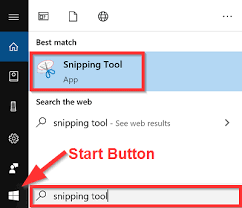
2. Select New to take a screenshot.
3. Rectangular mode is selected by default. You can change the shape of your snip by choosing one of the following options in the toolbar: Rectangular mode, Window mode, Full-screen mode, and Free-form mode.\
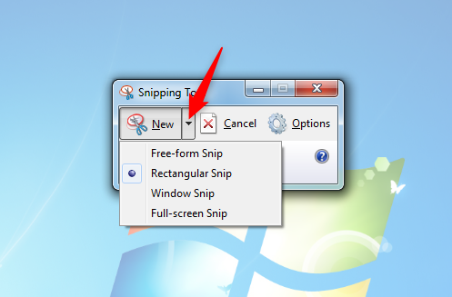
4. The screenshot is automatically copied to your clipboard. A notification also appears once you're finished taking a screenshot, select it for more editing options.
5. You can also save the screenshot like this:\
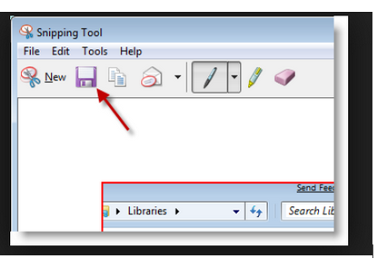

More information can be seen at the following [link from Microsoft](https://support.microsoft.com/en-us/windows/use-snipping-tool-to-capture-screenshots-00246869-1843-655f-f220-97299b865f6b)

### *To send assignment:*
1. rename the screenshot with your name and assignment day and number
2. Open your telegram app in PC.
3. Send the screenshot or the required assignments at the following telegram id: `@baba_aammar`
4. All other assignments should also be sent using similar method. -->

 -->

## **Resources, Books and Blogs Links:**

- [Python for Data Science- Complete Playlist](https://www.youtube.com/playlist?list=PL9XvIvvVL50Fba7psesg6ynQXdipw-yoN)
- Books:
  - [Python Data Science Handbook](https://jakevdp.github.io/PythonDataScienceHandbook/)
  - [Hands On Machine Learning with Scikit Learn and TensorFlow](https://github.com/yanshengjia/ml-road/blob/master/resources/Hands%20On%20Machine%20Learning%20with%20Scikit%20Learn%20and%20TensorFlow.pdf)

<!-- 
## **Course Content**

- [Day-1](#day-1)
- [Day-2](#day-2)
- [Day-3](#day-3)
- [Day-4](#day-4)
- [Day-5](#day-5)
- [Day-6](#day-6)
- [Day-7](#day-7)
- [Day-8](#day-8)
- [Day-9](#day-9)
- [Day-10](#day-10)
- [Day-11](#day-11)
- [Day-12](#day-12)
- [Day-13](#day-13) 
- [Day-14](#day-14) 
- [Day-15](#day-15) 
- [Day-16](#day-16) 
- [Day-17](#day-17)
- [Day-18](#day-18)
- [Day-19](#day-19)
- [Day-20](#day-20)
- [Day-21](#day-21)
- [Day-22](#day-22)
- [Day-23](#day-23)
- [Day-24](#day-24)
- [Day-25](#day-25)
- [Day-26](#day-26)
- [Day-27](#day-27)
- [Day-28](#day-28)
- [Day-29](#day-29)
- [Day-30](#day-30)
- [Day-31](#day-31)
- [Day-32](#day-32)
- [Day-33](#day-33)
- [Day-34](#day-34)
- [Day-35](#day-35)
- [Day-36](#day-36)
- [Day-37](#day-37)
- [Day-38](#day-38)
- [Day-39](#day-39)
- [Day-40](#day-40)
- [Your Feedback matters](#feedback) -->


> Everything related to course content in video lecture format will be uploaded **[here](https://youtube.com/playlist?list=PL9XvIvvVL50Fba7psesg6ynQXdipw-yoN)** on youtube.

## **Day-1**
> ### **Introduction to Python ka chilla and Data Science**
>
> Python k chilla ki pehli class main hame ye cheezen dekhi hyn:
> - What is Data Science?
> - Daily Life Examples
> - Installation of Python and VScode
> - Writing your first line of code
> - Data Types and operators
> - Different operation in CMD
> - What is an IDE (Integrated Development Environment)?
> - The use of chatGPT was also discussed in this lecture which can be seen in the following video [here](https://youtu.be/1YYUVfNPFaw?t=7)
>
> The video can be seen by clicking on the picture below.
>
[](https://youtu.be/Ux9ttEM2smk?t=106)

> ### **Installation of Python and VScode**
> 
> Python ko seekhnay se pehlay usay install karna zaroori hy or yahan ham 2 software install karen gay:\
>       1. Python form [this link](https://www.python.org/downloads/)\
>       2. VScode (Vidual Studio Code) from [this link](https://code.visualstudio.com/)\

Urdu main ham ne in software ko install krne ka tareeqa bhi bta dea hy, neechay image per click kar k video dekh saktay hyn. 

[](https://youtu.be/zcqW7Hp-FVk)

> ### **Write your first line of code with us**
> Is video main hame dekhen gay k ap ne installation k baad first line of code kaisay likhni hy jaisay ap ne [pichli Lecture](#introduction-to-python-ka-chilla-and-data-science) main dekha tha is main ham aik file k through bhi codes run karen gay.
>
> Lecture ko Urdu video main sunnay k liay is imagae per click karen
>
[](https://youtu.be/4T3cIOi61cg)

---
## **Day-2**

### **How to use VScode (an IDE) for Python?**
> Python ka chilla 2023 k doosray din main ham seekhen gay k IDE yani k VScode ko kaisay use karna hy to learn and use python in an efficient manner.
> 
> Day-1 main ap ne VScode ko install kia tha ab dekhtay hyn k vscode ko use kaisay karna hy?
> * Is video main ham ne vscode ki top extensions install karna dekhni hyn
> * Python ko VScode main run karna
> * File types or extensions kon kon si hti hyn woh dekhen gay
> * Python ki extension `.py` or `.ipynb` kia hti hyn ye dekhen gay
> * Questions kaisay poochnay hyn woh dekhen gay. Agar ap ka koi question hy tu ap [yahan per click kar k pooch len](https://github.com/AammarTufail/python_ka_chilla2023/discussions)
> * Ap ko isi video main future strategy bhi milay ge k agay walay din kaisay practice karni hy
>
> Is video per click karen and watch this whole session:
>
<!-- [](https://www.youtube.com/watch?v=NoDwrvFogiU&list=PL9XvIvvVL50Fba7psesg6ynQXdipw-yoN&index=6) -->

[](https://www.youtube.com/watch?v=NoDwrvFogiU&list=PL9XvIvvVL50Fba7psesg6ynQXdipw-yoN&index=6 "How to use VScode (an IDE) for Python?")

---
## **Day-3**
### **Basics of Python programming for Data Science (1/2)**

<!-- ### [**Basics of Python programming for Data Science**](./notebooks/01_python_basics.md) -->

You can learn Basics of Python Programming from these two Videos:
1. Live Zoom Session of Day-3:\
[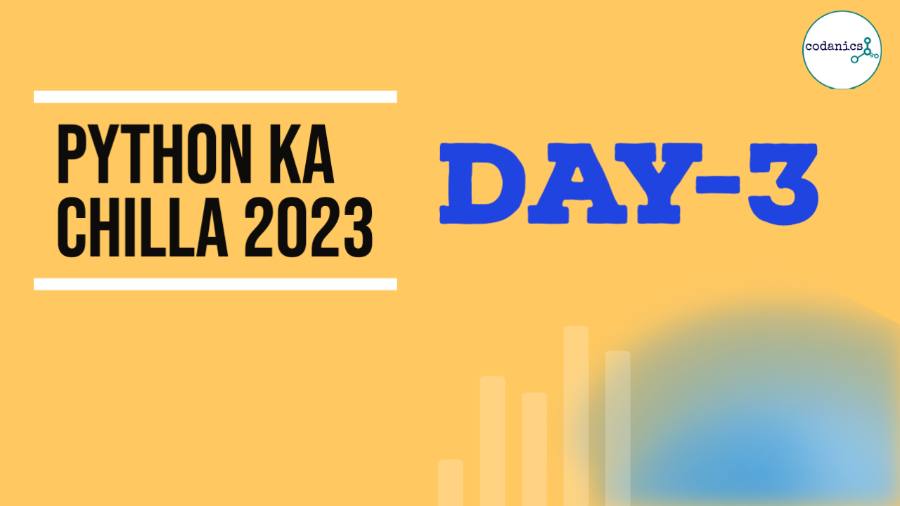](https://youtu.be/7f2Ns75ibOc "Python-101 Live")

2. Python Programming (Python-101) by clicking on this:\
[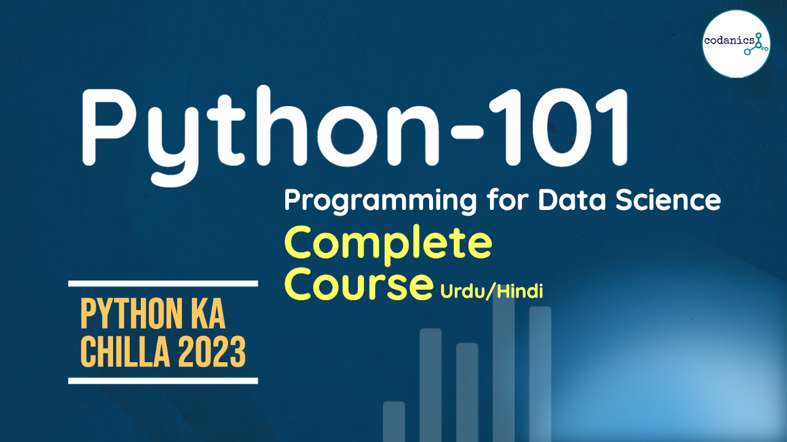](https://youtu.be/930zolu8E2g "Python-101 COmplete Python?")

## **Day-4**
### **Basics of Python programming for Data Science (2/2)**

1. Ye day-3 ka lecture hy is ko finish karen or at least 3 martaba practice karen takay ye concepts ap ko clear ho jayen, phir hi agar maza aana seekhnay ka, warna issue hi rehnay ap ko (Agar ap yahan se kuch miss karen gay then ap ko maslay hnay walay hyn agay):
Python Programming (Python-101) by clicking on this:\
[](https://youtu.be/930zolu8E2g "Python-101 COmplete Python?")

1. This was the live zoom session where we discused variables, input_function and much more. watch the video by clicking following figure:\
[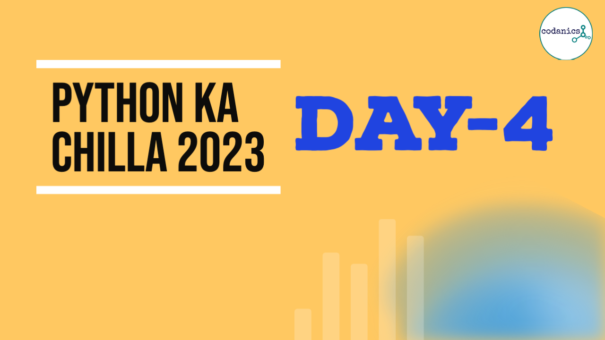](https://youtu.be/6wd60_vpQ6c "Python-101 Practice?")

## **Day-5**
### **Jupyternotebook Introduction, Libraries and Data Visualization**

Is lecture main ham dekhen gay k:
1. jupyter notebooks `.ipynb` extension wali kia hti hyn? [video is here](https://youtu.be/V5Pk5qvRo7A?t=273)
2. Libraries kia hti hyn, kis liay use htin, Install kaisay ki jati hyn, and import kaisay karni hyn? [video is here](https://youtu.be/V5Pk5qvRo7A?t=2176)
3. Data Visualization kaisay ki jati hy in Python? [video is here](https://youtu.be/V5Pk5qvRo7A?t=4124)
4. Complete Lecture is here:\
[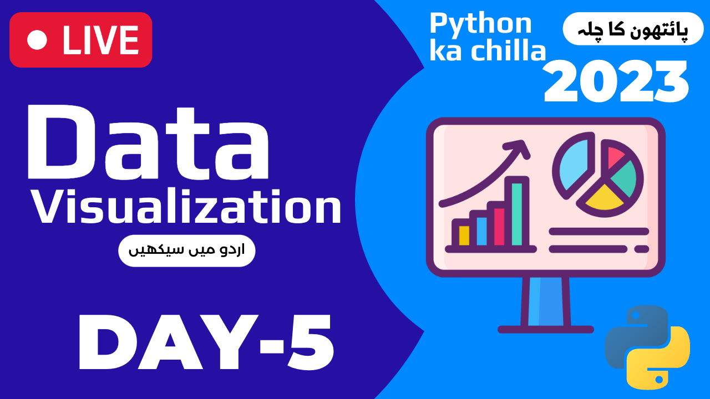](https://youtu.be/V5Pk5qvRo7A "Day-5 Lecture")

### **Markdown Language in 75 Minutes (This video is taken from Python ka chilla 2022**

- Here you must learn Markdown language to make jupyter notebooks and `.md` files for github before moving ahead.\
[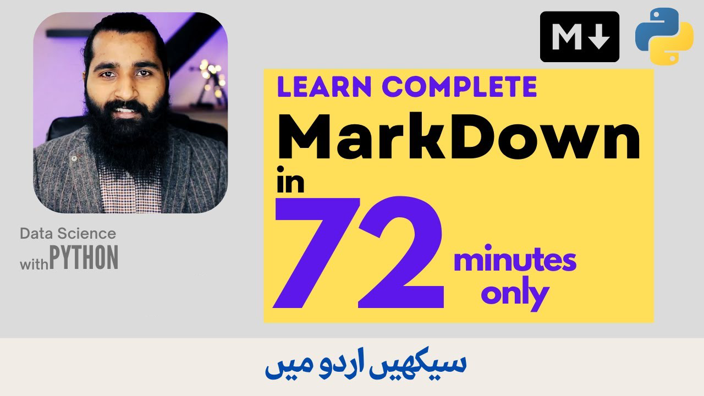](https://youtu.be/qJqAXjz-Rh4?t=5 "MarkDown in 72 minutes")

## **Day-6**
### **Pandas_01**

Here is the dataset to work on [download here](datasets/pandas_01_day6.xlsx)

In this lecture you will see how pandas library can be used to import the dataset and run basic functions on that dataset

[](https://www.youtube.com/watch?v=QllPdI6c_Ko&list=PL9XvIvvVL50Fba7psesg6ynQXdipw-yoN&index=11&t=2s "Pandas basics")

## **Day-7**
### **Pandas library basic functions**

In this lecture you will see how pandas library can be used to import the dataset and run basic functions on that dataset

[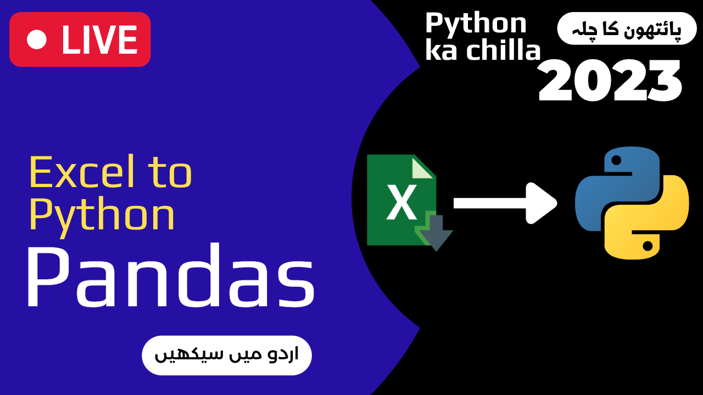](https://www.youtube.com/watch?v=dnVZryp-qag&list=PL9XvIvvVL50Fba7psesg6ynQXdipw-yoN&index=12 "Pandas basics")

## **Day-8**
### **Pandas tips and tricks**

Is lecture main ham seekhen gay k `pandas` library ko use karne ki tips and tricks kon konsi hyn.\
Ye lecture long hyn tu ap se request hy is ko poora dekh k sath sath pactice b karen.\
Lecture dekhnay k liay neechay is picture per click karen

[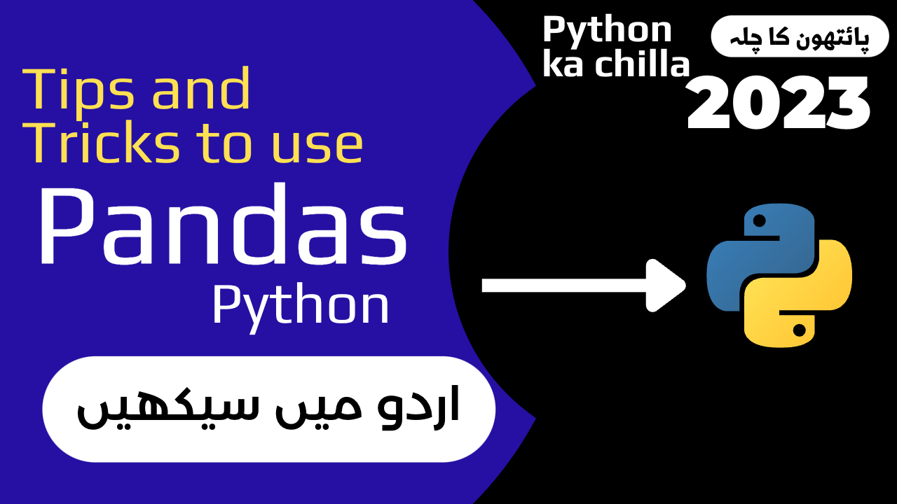](https://youtu.be/Ozil3_akpR8 "Pandas tips and tricks-Lecture")

## **Day-9**
### **Pandas practice online**

Is lecture main ham pandas main or b details se practice karen gay.\
[](https://youtu.be/K_i7VGtzGNU "Pandas practice")

## **Day-10**
### **Data Wrangling and Data Visualization (Basics)**

Is lecture main ham cheat sheets dekhnay walay hyn jo bht important hun ge data wrangling karne k liay.
Cheat sheets yahan se download kar len [Download all Cheat Sheets here](./resources/cheat_sheets/)

[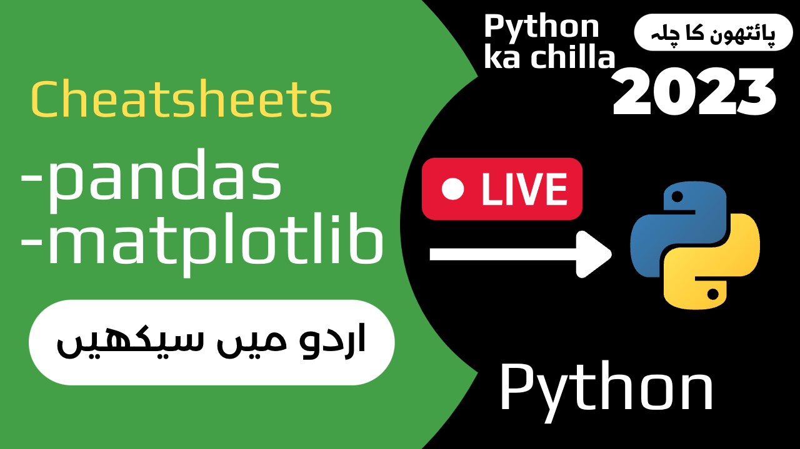](https://youtu.be/XZXmK3D_5-A "Data Wrangling and Data Visualization")


 ## **Day-11**
### **Data Visualization**

Plots or graphs bnanay k liay ap ko python se behtar koi language nahi milni or isi baat ko btanay k liay aaj k lectures hyn. In main ap seekhen gay k python ki different libraries like `matplotlib` and `seaborn` ko use kar kaisay plot bnaye jatay hyn

1. Is video main ap seekhen gay plotting hti kia hy or q zaroori hy:\
[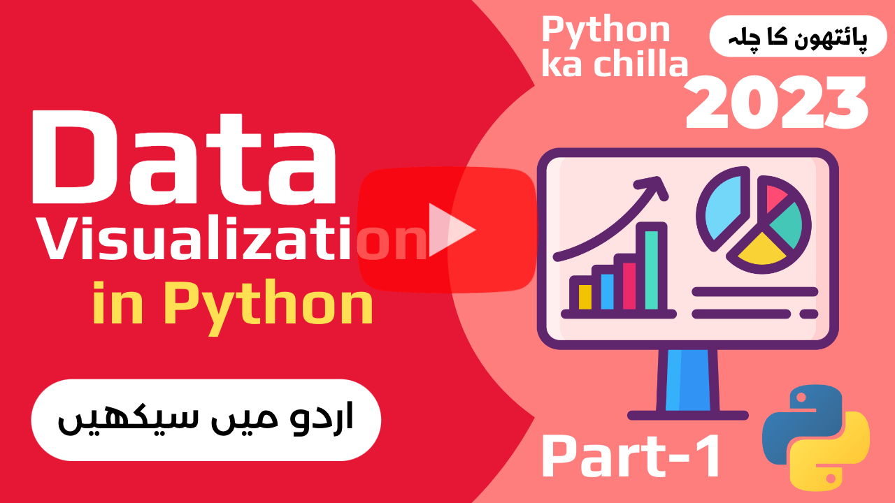](https://youtu.be/2yWoQ-RICmU "Data Visualization Theory")

2. Is video main aap dekhen gay k python main coding kar k plots kaisay bna saktay hyn:\
[](https://youtu.be/IVtFDKR_KOA "Data Visualization")

## **Day-12**
### **Exploratory Data Analysis (Basics)**

[](https://youtu.be/sCdu54Mq0FA "Data Wrangling and EDA with python")

## **Day-13**
### **Exploratory Data Analysis (A-Z)**

[](https://youtu.be/419WLiki7jI "EDA with python")

## **Day-14**
### **ABC of Statistics**

>Watch the following playlist to learn basic statistics for Data Science.\
[Click here to watch ABC of Statistics](https://youtube.com/playlist?list=PL9XvIvvVL50Hsio_tunNVlAq9XhB4cU2J)

## **Day-15**
### **Python Data Wrangling Techniques: From Beginner to Pro**

>Today we will learn Data Wrangling in python:

**`Data wrangling`**, also known as `data munging`, is the process of cleaning, transforming, and organizing data in a way that makes it more suitable for analysis. It is a crucial step in the data science process as real-world data is often messy and inconsistent. 

[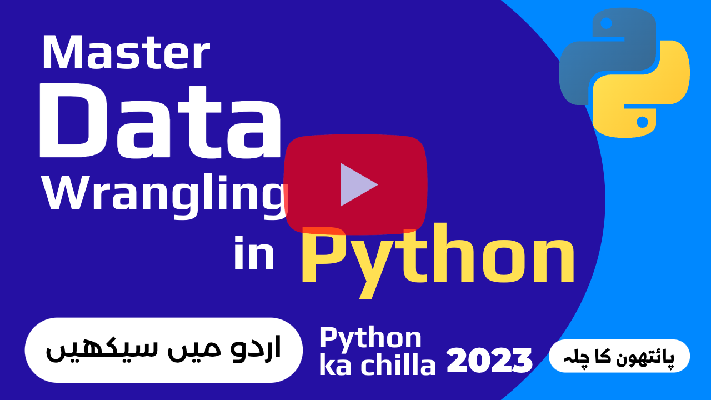](https://www.youtube.com/watch?v=jp93e9DDBlo&list=PL9XvIvvVL50Fba7psesg6ynQXdipw-yoN&index=21 "Data Wrangling")

The general steps to do `Data Wrnagling` in python are as follows:

>**Steps to perform data wrangling on the Titanic dataset in Python using pandas library:**
>The steps of data wrangling in Python typically include:
1. Importing necessary libraries such as Pandas, NumPy, and Matplotlib
2. Loading the data into a Pandas DataFrame
3. Assessing the data for missing values, outliers, and inconsistencies
4. Cleaning the data by filling in missing values, removing outliers, and correcting errors
5. Organizing the data by creating new columns, renaming columns, sorting, and filtering the data
6. Storing the cleaned data in a format that can be used for future analysis, such as a CSV or Excel file
7. Exploring the data by creating visualizations and using descriptive statistics
8. Creating a pivot table to summarize the data
9. Checking for and handling duplicate rows
10. Encoding categorical variables
11. Removing unnecessary columns or rows
12. Merging or joining multiple datasets
13. Handling missing or null values
14. Reshaping the data
15. Formatting the data
16. Normalizing or scaling the data
17. Creating new features from existing data
18. Validating data integrity
19. Saving the final data for future use
20. Documenting the data wrangling process for reproducibility

Please note that the steps may vary depending on the data, the requirements, and the goals of the analysis.
It's worth noting that these are general steps and the specific steps you take will depend on the dataset you are working with and the analysis you plan to perform.

----
Here is an example of how to perform data wrangling on the `titanic` dataset in Python using the pandas library:

```python
# Import the necessary libraries
import pandas as pd
import numpy as np
import matplotlib.pyplot as plt
import seaborn as sns

# Load the Titanic dataset into a pandas DataFrame
titanic = sns.load_dataset('titanic')

# View the first few rows of the dataset
titanic.head()

# View the column names and data types
titanic.info()

# Check for missing values
print(data.isnull().sum())

# Handle missing values
# Option 1: Drop rows with missing values
titanic.dropna(inplace=True)

# Option 2: Impute missing values
titanic['Age'].fillna(titanic['Age'].mean(), inplace=True)


# Check for outliers and remove or transform them as necessary
sns.boxplot(x=titanic['age'])

# Transform outliers
titanic['Age'] = np.log(titanic['Age'])

# Feature engineering
titanic['family_size'] = titanic['sibsp'] + titanic['parch'] + 1
titanic['is_alone'] = 1 # initialize to yes/1 is alone
titanic['is_alone'].loc[titanic['family_size'] > 1] = 0 # now update to no/0 if family size is greater than 1

# Group and aggregate data
data = titanic.groupby('Pclass').mean()

# Save the cleaned dataset
titanic.to_csv('titanic_cleaned.csv', index=False)
```
This is just one example of how to perform data wrangling on the Titanic dataset, but there are many other ways you can handle missing values, outliers, and feature engineering. The important thing is to understand the data, and to make decisions based on the context of the problem you're trying to solve.

Another way of treating the data is as follows:

```python
# Import the necessary libraries
import pandas as pd
import numpy as np
import matplotlib.pyplot as plt
import seaborn as sns


# Load the Titanic dataset
data = pd.read_csv('titanic.csv')

# View the first few rows of the dataset
print(data.head())

# Check for missing values
print(data.isnull().sum())

# Handle missing values
data['age'].fillna(data['age'].median(), inplace=True)
data['embarked'].fillna(data['embarked'].mode()[0], inplace=True)

# Check for outliers
# Option 1: Remove outliers
q1 = data["fare"].quantile(0.25)
q3 = data["fare"].quantile(0.75)
iqr = q3-q1 
fence_low = q1-1.5*iqr
fence_high = q3+1.5*iqr
data = data[(data["fare"] > fence_low) & (data["fare"] < fence_high)]

# Option 2: Transform outliers
data['fare'] = data['fare'].apply(lambda x: x if x < 100 else 100)

# Feature engineering
#if the titles are given in the dataset
data['Title'] = data.Name.str.extract(' ([A-Za-z]+)\.', expand=False)
data['Title'] = data['Title'].replace(['Lady', 'Countess','Capt', 'Col','Don', 'Dr', 'Major', 'Rev', 'Sir', 'Jonkheer', 'Dona'], 'Rare')
data['Title'] = data['Title'].replace('Mlle', 'Miss')
data['Title'] = data['Title'].replace('Ms', 'Miss')
data['Title'] = data['Title'].replace('Mme', 'Mrs')
data = data.drop(['Name'], axis=1)
data = pd.get_dummies(data, columns = ["Title"])

# Group and aggregate data
data = data.groupby(['Pclass', 'Sex']).mean()

# Save the cleaned dataset
data.to_csv('titanic_cleaned.csv', index=True)
```
In this example I have used IQR method to check for outliers, and I have used some feature engineering techniques, like extracting title from the name and creating dummies variables and also I have grouped the data by Pclass and Sex and taken the mean of the data.

It's important to note that the steps you take during data wrangling will vary depending on the dataset and the specific analysis you plan to perform. The examples above should give you an idea of the types of tasks that are typically involved in data wrangling and how to perform them using the pandas library.

---
## **Day-16**
### **Machine Learning Basics**

In this lecture we will learn what is machine learning and how we can implement that in our everyday life, projects and science themes.

[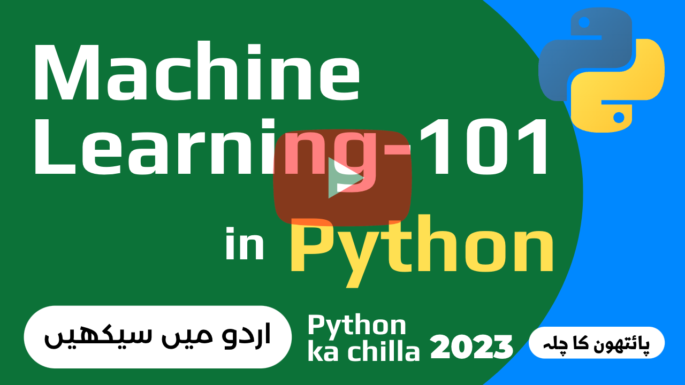](https://youtu.be/AJElOIz8ysU "Machine Learning Zero-Advanced level | in Urdu/Hindi | Day-16")

----
## **Day-17**
### **Machine Learning Basics-1**

In this lecture we will learn what is machine learning with explained and detailed example
- Types of Machine learning
- Algorithms in ML
- Regression vs. Classification
- Much more\

Here is the video:

[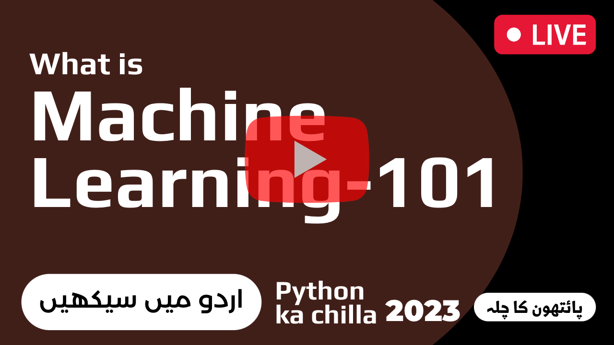](https://www.youtube.com/watch?v=oCguRWNFqs4&list=PL9XvIvvVL50Fba7psesg6ynQXdipw-yoN&index=23&t=1282s "What is Machine Learning")

----
## **Day-18**
### **Regression (Machine Learning Basics-2)**

In this lecture we will learn how to use linear regression model in Machine learning, what is it and how we can implement that in real life?

Here is the video:

[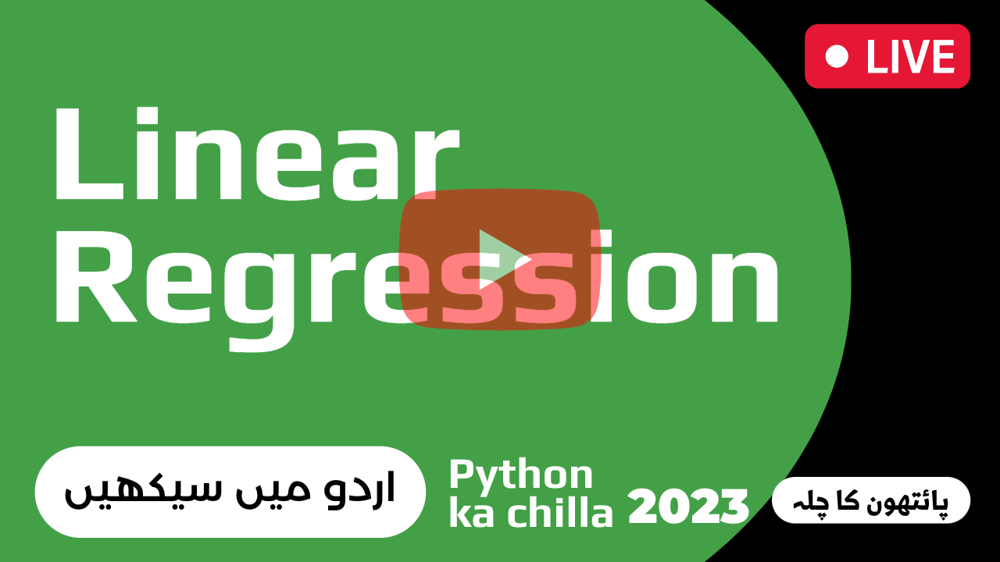](https://www.youtube.com/watch?v=yEMS0QXflew&list=PL9XvIvvVL50Fba7psesg6ynQXdipw-yoN&index=24 "Linear Regression in Machine Learning")

----
## **Day-19**
### **Classification (Machine Learning Basics-3)**

In this lecture we will learn how to use classification model in Machine learning, what is it and how we can implement that in real life?

Here is the video:

[](https://youtu.be/0k7hEy_9fJg "Classification in Machine learning | in Urdu/Hindi | Day-19")

----
## **Day-20**
### **How to select a best Model in Machine learning with Scikit-learn?**

In this lecture we will learn how to select a best model in Machine learning, what is it and how we can implement that in real life?

Here is the video:

[](https://www.youtube.com/watch?v=XiUJwXglo5s&list=PL9XvIvvVL50Fba7psesg6ynQXdipw-yoN&index=26 "ML with Scikit-learn | in Urdu/Hindi | Day-20")

Send me your assignment if you enrolled in the course:

Here is the code mentioned in the video:

```python
# Import the necessary libraries
# import libraries
import pandas as pd
import numpy as np
import seaborn as sns
import matplotlib.pyplot as plt

df = sns.load_dataset("titanic")
X = df[['pclass', 'sex', 'age', 'sibsp', 'parch', 'fare']]
y = df['survived']
X = pd.get_dummies(X, columns=['sex'])
X.age.fillna(value = X['age'].mean(), inplace=True)


from sklearn.linear_model import LogisticRegression
from sklearn.svm import SVC
from sklearn.tree import DecisionTreeClassifier
from sklearn.ensemble import RandomForestClassifier
from sklearn.neighbors import KNeighborsClassifier
from sklearn.metrics import accuracy_score, f1_score, precision_score, recall_score
from sklearn.model_selection import train_test_split

X_train, X_test, y_train, y_test = train_test_split(X, y, test_size=0.2, random_state=42)

models = [LogisticRegression(), SVC(), DecisionTreeClassifier(), RandomForestClassifier(), KNeighborsClassifier()]
model_names = ['Logistic Regression', 'SVM', 'Decision Tree', 'Random Forest', 'KNN']

models_scores = []
for model, model_name in zip(models, model_names):
    model.fit(X_train, y_train)
    y_pred = model.predict(X_test)
    accuracy = accuracy_score(y_test, y_pred)
    models_scores.append([model_name,accuracy])

sorted_models = sorted(models_scores, key=lambda x: x[1], reverse=True)
for model in sorted_models:
    print("Accuracy Score: ",f'{model[0]} : {model[1]:.2f}')


# Accuracy Score:  Random Forest : 0.81
# Accuracy Score:  Decision Tree : 0.79
# Accuracy Score:  KNN : 0.76
# Accuracy Score:  Logistic Regression : 0.75
# Accuracy Score:  SVM : 0.74

models = [LogisticRegression(), SVC(), DecisionTreeClassifier(), RandomForestClassifier(), KNeighborsClassifier()]
model_names = ['Logistic Regression', 'SVM', 'Decision Tree', 'Random Forest', 'KNN']
models_scores = []
for model, model_name in zip(models, model_names):
    model.fit(X_train, y_train)
    y_pred = model.predict(X_test)
    Precision = precision_score(y_test, y_pred)
    models_scores.append([model_name,Precision])

sorted_models = sorted(models_scores, key=lambda x: x[1], reverse=True)
for model in sorted_models:
    print("Precision Score: ", f'{model[0]} : {model[1]:.2f}')

# Precision Score:  Random Forest : 0.80
# Precision Score:  Decision Tree : 0.78
# Precision Score:  KNN : 0.75
# Precision Score:  Logistic Regression : 0.74
# Precision Score:  SVM : 0.73

models = [LogisticRegression(), SVC(), DecisionTreeClassifier(), RandomForestClassifier(), KNeighborsClassifier()]
model_names = ['Logistic Regression', 'SVM', 'Decision Tree', 'Random Forest', 'KNN']
models_scores = []
for model, model_name in zip(models, model_names):
    model.fit(X_train, y_train)
    y_pred = model.predict(X_test)
    Recall = recall_score(y_test, y_pred)
    models_scores.append([model_name,Recall])

sorted_models = sorted(models_scores, key=lambda x: x[1], reverse=True)
for model in sorted_models:
    print("Recall Score: ",f'{model[0]} : {model[1]:.2f}')

# Recall Score:  Random Forest : 0.74
# Recall Score:  Decision Tree : 0.72
# Recall Score:  KNN : 0.68
# Recall Score:  Logistic Regression : 0.67
# Recall Score:  SVM : 0.65

models = [LogisticRegression(), SVC(), DecisionTreeClassifier(), RandomForestClassifier(), KNeighborsClassifier()]
model_names = ['Logistic Regression', 'SVM', 'Decision Tree', 'Random Forest', 'KNN']
models_scores = []
for model, model_name in zip(models, model_names):
    model.fit(X_train, y_train)
    y_pred = model.predict(X_test)
    F1 = f1_score(y_test, y_pred)
    models_scores.append([model_name,F1])

sorted_models = sorted(models_scores, key=lambda x: x[1], reverse=True)
for model in sorted_models:
    print("F1 Score: ",f'{model[0]} : {model[1]:.2f}')

# F1 Score:  Random Forest : 0.77
# F1 Score:  Decision Tree : 0.75
# F1 Score:  KNN : 0.71
# F1 Score:  Logistic Regression : 0.70
# F1 Score:  SVM : 0.68
```

----
## **Day-21**
### **How to select a best parameters in a Machine learning model with Scikit-learn?**

In this lecture we will learn how to select a best parameters in a model using gridsearch CV in scikit-learn

Here is the video:

[](https://youtu.be/-IHgSW5dB5s "Grid Seach cv | in Urdu/Hindi | Day-21")

Here is the code mentioned in the video:

```python
# Decision Tree Classifier and use best parameters
import pandas as pd
import seaborn as sns
df = sns.load_dataset("titanic")
X = df[['pclass', 'sex', 'age', 'sibsp', 'parch', 'fare']]
y = df['survived']
X = pd.get_dummies(X, columns=['sex'])
X.age.fillna(value = X['age'].mean(), inplace=True)

from sklearn.tree import DecisionTreeClassifier
from sklearn.model_selection import GridSearchCV
import numpy as np
#create a model
model = DecisionTreeClassifier()
# define parameter grid
param_grid = {'max_depth': [3, 5, 7, None], 'min_samples_split': [2, 3, 4]}

#object grid search cv (Creating the model)
grid_search = GridSearchCV(model, param_grid, cv=5, scoring='precision')

#traing the model
grid_search.fit(X,y)

# print the best parameters
print("Best Parameters: ", grid_search.best_params_)
print("Best Score: ", grid_search.best_score_)

# Best Parameters:  {'max_depth': 3, 'min_samples_split': 2}
# Best Score:  0.775
```

In your assignments:

Please write a code where you can select the best model based on grid search cv!


----

## **Day-22**
### **Machine learning terminologies and theoratical concepts (Part-1)**

Sab se pehlay is lecture main ap o K-means clustering kaisay python main apply ki jati hy woh sikhaya jaye ga:

[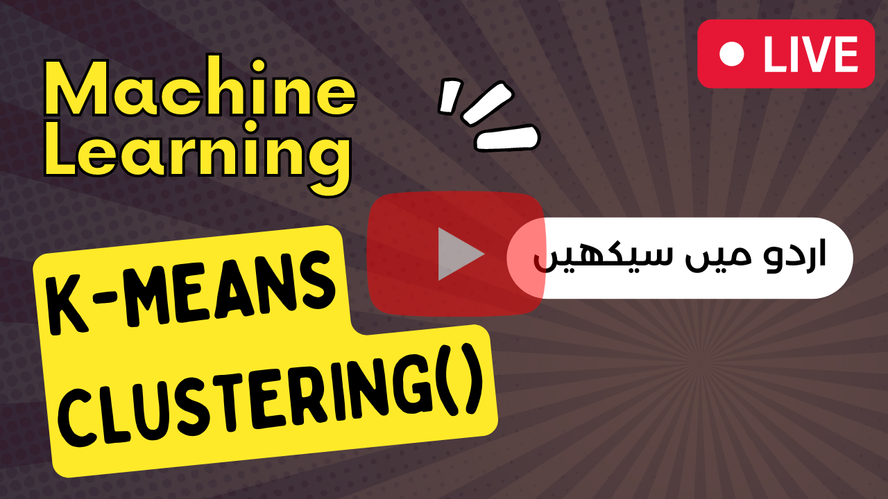](https://youtu.be/jdYTpYu4THE "Kmeans Clustering in Python")


Ab se agalay 2 din ham machine learning k basic concepts dekhnay walay hyn, jo terminologies machine learning main use hti hyn woh seekhen gay, ye lectures bht important hyn is liay inhen skip na kijeay ga.

Agar ap yahan tak seekh ayen hyn tu yaqeen manen ap ny in concepts ko already bht had tak dekha hy, ab clear ho jayen gay or.


> Es video may hum Machine Learning ka introduction dekhyn gyn k wo hoti kya hay or is ML playlist may hum ainda kya chzyn dekhny walay hayn.
> 
[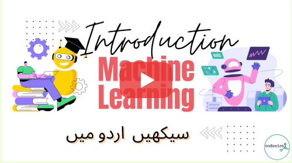](https://www.youtube.com/watch?v=eYXCw2FQfPA "ML")

> Cross validation ka nam hum bht zeada suntay hayn ML ki dunya may or is video may hum bht h desi example k sath dekhyn gyn k Cross validation (CV) kya hota hay or us ki mukhtalif types i.e., 4 fold CV, 10 fold CV, etc.

[](https://www.youtube.com/watch?v=iy3B94qUAV8 "ML")

> Confusion matrix hmyn bht h zeada confuse rakhta hay is liay isko asan bnanay k liay ye video ap k liay desi examples k sath mojood hay jis may hum nay dekha hay k confusion matrix ki zrurat kiun hay or hum kis trhn bnatay hayn jis may True Positive, True Negatives, False Positives or, False Negatives ko smjha hay.

[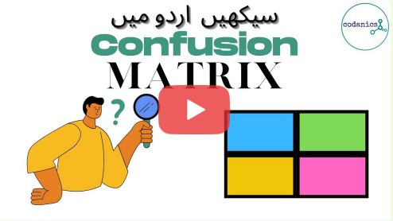](https://www.youtube.com/watch?v=bm_pw-TxwmE "ML")

> Jab hum koi b model bnatay hayn to us ko chk krty hayn k wo kitna acha kam kr raha hay. Sirf accuracy say kam nai chlta hr baar is liay ye dekhna prta hay k us k andr model kitnay positives (sensitivity) or kitnay negatives ( specificity) sai say model nay btaey hayn.

[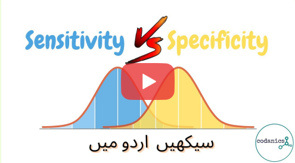](https://www.youtube.com/watch?v=2nwjKvFsxBI "ML")

> Agar ap nay 2 model bnaey hayn jis may say 1 model bht acha fit hua hay or aek model bht achi prediction kr raha hay to apko un dono ko kesay istemal krna chaheay is ko smjhnay k liay BIAS -VARIANCE tradeoff ka concept smjhna zruri hay.

[](https://www.youtube.com/watch?v=12hx3VCoShY "ML")

> Entropy Ka lfzi mtlb to ye hay k ap k data may Randomness/ disorder Kitna hay lekin machine learning ki dunya may is ko hum kis trhn istemal krtay hayn is video may achay say bht h sada or asan treqay say smjhaya hay ta k ap ainda jab b Entropy istemal kryn ML may to apko idea ho k ap isay kiun or kesay istemal kr skty hayn.

[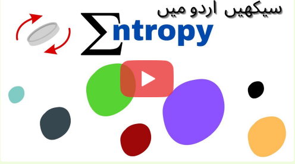](https://www.youtube.com/watch?v=VUroGmmD1hc "ML")

> Bht h zeada asan or aam ML Ka model hay linear regression model pr is may istemal honay walay concepts sbb KO smjh nai aatay. Is liay is video may ye btaya geya hay k linear regression hota kya hay, residual kisay kehtay hayn.

[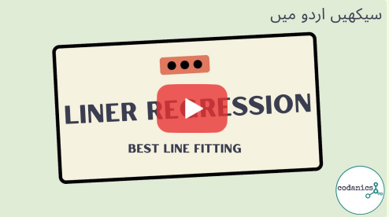](https://www.youtube.com/watch?v=fXTMJniHdpc "ML")

> Hum square kiun krty hayn difference KO or least squared residuals kya hotay hayn or kiun hum usay regression may dekhty hayn isi trhn agar hum higher dimensions may jaeyn ( aam lfzon may agar humaray paas 1 say zeada independent variables hon to kis trhn us may regression Ka model lgta hay us k liay ye video dekhna ap k liay bht zruri hay ( multiple regression)

[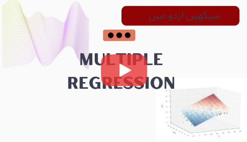](https://www.youtube.com/watch?v=iptI-dqLr-M "ML")

----

## **Day-23**
### **Machine learning terminologies and theoratical concepts (Part-2)**


> Aam dunya may sbb Kuch linear nai hota isi liay hum HR Baar linear regression k models istemal nai krty is liay jab b hmaray paas dependent variable may categorical/Boolean data ho to hum istemal krtay hayn Logistic regression. Is video may hum nay Dekha k logistics regression kis trhn different hay linear regression say, s curve Ka kya concept hay or kya higher dimensional logistic regression Hoti hay.

[](https://www.youtube.com/watch?v=Kmk9EeFnyHM "ML")


> ROC ( Receive operating characteristic) and AUC ( area under the curve) dono mil k hmyn btatay hayn k model kis trhn perform kr Raha hay. ROC aek probability curve hay or AUC us may ye btata hay k measure of separability kitni hay model ki ye dono aek sath accuracy say zeada Acha model ko evaluate krty hayn jab class imbalanced Hoti hay, is video may ye chz asan lfzon may discuss ki hui hay or ye b btaya geya hay k hum in KO kesay bna skty hayn or kesay interpretation kr skty hayn.

[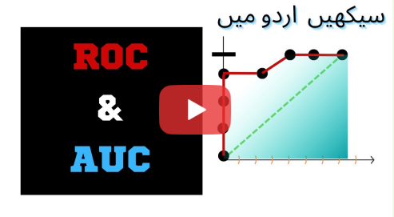](https://www.youtube.com/watch?v=-f-mvDObG1U "ML")

> Logistic regression may s-curve ko fit krnay k liay hum nay Jo method istemal Kia hay ( maximum likelihood) Ka wo in detail kesay lgta hay or is may hum least squared residuals wala method kiun istemal nai krty.

[](https://www.youtube.com/watch?v=CQOzUDd_83U "ML")

> Or agar hum model ko chk kr rhy hayn k model Kitna accurate and reliable hay to us liay hum R-squared logistic regression may kis trhn calculate krty hayn or interpret krty hayn.
> 
[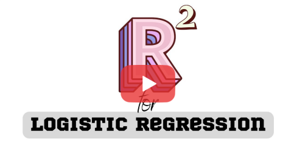](https://www.youtube.com/watch?v=JmVvPqR44h4 "ML")


> jab b hmaray model may overfitting/underfitting Ka issue ata hay to hum Realizations techniques use krty hayn or is may data or model ki noyiat Dekh k hum ye faisla krty hayn k hum kis technique pay focus kryn gyn. Jab data may bht saray usefull variables hon to hum mostly L2 use krty hayn.

[](https://www.youtube.com/watch?v=nv-HHBxmfv4 "ML")

> or jab useless variables zeada hon to hum L1 use krty hayn.

[](https://www.youtube.com/watch?v=QDSQivx78eA "ML")

> or jab hum drmean may hon to phir hybrid technique Elastic net istemal krtay hayn.

[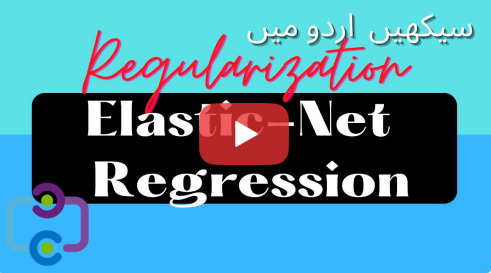](https://www.youtube.com/watch?v=AwbS2d1xYIQ "ML")

> Principal component analysis (PCA) hum zeada tr feature selection/ dimension reduction k liay istemal krtay hayn. Is video may hum nay ye Dekha hay in detail k ML may exactly kb or kesay PCA istemal KR k apna Kam asaan Kia ja skta hay or is may mojooe eigen vectors Ka concept b asan lfzon may btaya geya hay.

[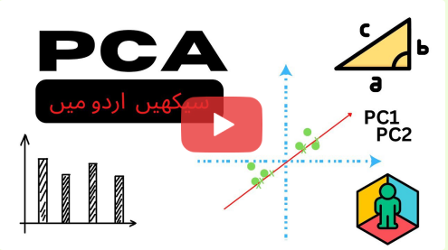](https://www.youtube.com/watch?v=FufGzT9az4Y "ML")

> Regression techniques k baad hum nay ye Dekha k Clustering kis trhn ki jati hay or is Ka mtlb kya hay or zrurat kiun Hoti hay. Aek bht h asan or famous techniques K-MEANS CLUSTERING ki hum is may kesay istemal krtay hayn or is may K , MEANS dono Ka mtlb kya hay or hum kesay decide krty hayn k K kya lena chaheay kis say hmara Kam asaan ho sky.

[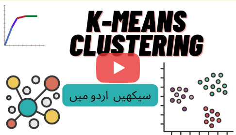](https://www.youtube.com/watch?v=W9cl8xKQPOc "ML")

## **Day-24**
### **How to save and re-use a model**

Is lecture main ham ne seekha k kis trah ham apna trained ML model save kartay hyn, click the image below to watch the video lecture:

[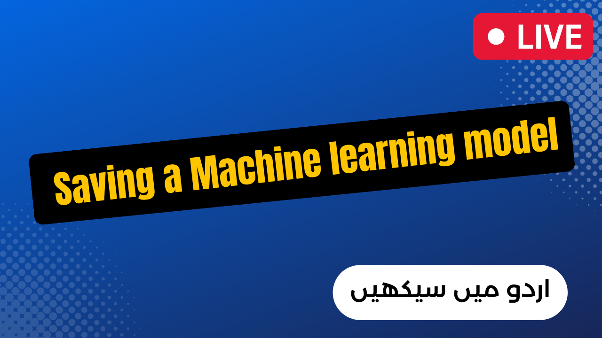](https://www.youtube.com/watch?v=b0NnVf31vps&list=PL9XvIvvVL50Fba7psesg6ynQXdipw-yoN&index=29 "joblib")

## **Day-25**
### **Practice session individual**

Download any dataset on covid and submit the EDA on telegram if you want to have a feedback.

1. Download the data from [google datasearch](https://datasetsearch.research.google.com/)
2. Read in python
3. Run EDA analysis
4. Do data wrangling
5. Data Visualization
6. Machine learning model of your choice
7. Submit

## **Day-26**
### **How to use Conda environments?**

[](https://youtu.be/nsFdTgwDrVE "conda environments")

## **Day-27**
### **Machine Learning with Tensorflow**

You will learn these in this lecture:

1. What are conda environments?
2. How to install tensorflow for GPU and CPU PCs?
   1. [Here's how install in Windows PC](https://www.tensorflow.org/install/pip#step-by-step_instructions)
   2. [Here's how to install in Mac M1/M2](https://medium.com/mlearning-ai/install-tensorflow-on-mac-m1-m2-with-gpu-support-c404c6cfb580)
3. What is git and github?


[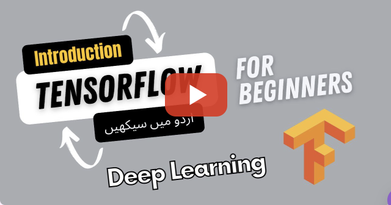](https://youtu.be/iNENqZOrgiY "tensorflow")

After this lecture you have send the video presentation as mentioned in the lecture.

## **Day-28**
### **neural Networks introduction**

Is video main ap neural network or is ki types dekhnay walay hyn.

[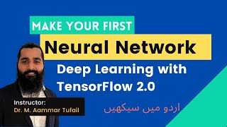](https://www.youtube.com/watch?v=6AlfcbhgBvo&list=PL9XvIvvVL50Fba7psesg6ynQXdipw-yoN&index=32&t=970s "neural networks")


## **Day-29**
### **Computer Vision in PYTHON**

This video will give you the basic concepts of computer vision in python.

[](https://youtube.com/live/5VZX-ovRgAgDay29 "computer vision")

## **Day-30**
### **Image Classification in Tensorflow**

This video will give you the basic concepts of activation function in tensorflow.

[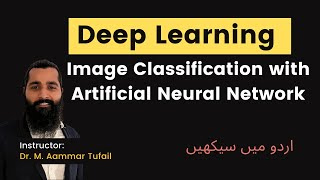](https://youtu.be/ch2Yl40D9zk "Image Classification in Tensorflow")

## **Day-31**
### **Machine learning and Activation function in Tensorflow**

This video will give you the basic concepts of activation function in tensorflow.

[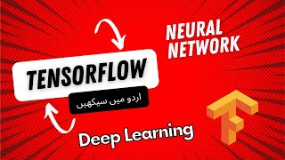](https://youtube.com/live/UEPkIu8mHL4 "ML with TF")

## **Day-32**
### **Crash course on Activation Functions**

This video will give you the basic concepts of activation function in tensorflow.

[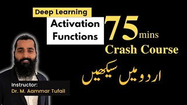](https://youtu.be/tW6v915O4g4 "Activation Functions")

## **Day-33**
### **Project based learning**

In thie lecture we used fashion mnist dataset to do some machine learning and deep learning tasks in Python with tensorflow.


#### **What is tensorflow fasion mnist dataset?**
60,000 28x28 grayscale images of 10 fashion categories, along with a test set of 10,000 images.
This dataset can be used as a drop-in replacement for MNIST. The class labels are:
Label Description
* 0:	T-shirt/top
* 1:	Trouser
* 2:	Pullover
* 3:	Dress
* 4:	Coat
* 5:	Sandal
* 6:	Shirt
* 7:	Sneaker
* 8:	Bag
* 9:	Ankle boot

HERE IS THE LECTURE:\
[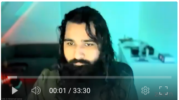](https://www.youtube.com/watch?v=Is0EB1jkop8&list=PL9XvIvvVL50Fba7psesg6ynQXdipw-yoN&index=37 "Project based learning")

## **Day-34**
### **How many epocs should we run in a deep neural network?**

Call back function ko use kar k ham andaza laga saktay hyn k kitnay epochs use karnay chaheay based on the accuracy or loss, is lecture main ap ko sab clear hnay wala hy.

HERE IS THE LECTURE:\
[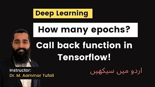](https://youtu.be/o_41Gxk_JQA "Project based learning")

## **Day-35**
### **Types of Neural Networks**

In this lecture we will learn about the types of neural networks.

HERE IS THE LECTURE:\
[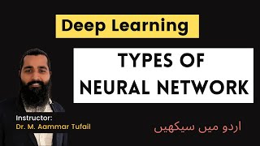](https://youtu.be/GGOjRuiU3fE "Types of Neural Networks")


## **Day-36**
### **Streamlit Dashboards for Data Science**

Is lecture main ap streamlit ko dekhen gay. jo aik library hy jis se ap behtareen qisam ki webapps bna saktay hyn asani se.

Ye din several parts main hy is liay bear with me and learn alot today.

1. Intro to Streamlit

    [](https://youtu.be/5bY-g9p_mxs "Streamlit-1")

2. Streamlit with titanic dataset

    [](https://youtu.be/hy0A6wxlBuM "Streamlit-2")

3. Streamlit with Plotly

    [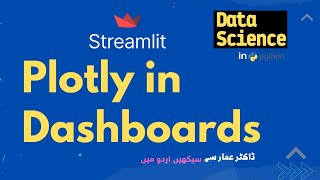](https://youtu.be/FIkHuQ5-94w "Streamlit-3")

4. Animated plots with Streamlit & Plotly

    [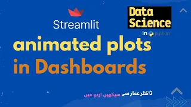](https://youtu.be/gIKgqBH-dTM "Streamlit-4")

5. Streamlit webb app for EDA analysis

    [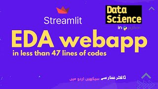](https://youtu.be/crZcSoBLYaM "Streamlit-5")

6. Streamlit k Jugaar

    [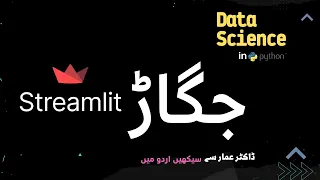](https://youtu.be/ye7uSnLGkXY "Streamlit-6")

7. Machine Leaning Web-application in python with streamlit

    [](https://youtu.be/goR8rWxJ-j0 "Streamlit-7")

8. Deploy a streamlit data science app online

    [](https://youtu.be/_Dc42sybVoQ "Streamlit-8")

9. Add video & audio to your streamlit data science webapp in python

    [](https://youtu.be/m9KhCRwKOgI "Streamlit-9")
10. Add code to streamlit webapp

    [](https://youtu.be/wnRncTcyuFM "Streamlit-10")

11. Make Interactive Dashboard with Explainer Dashboard

    [](https://youtu.be/WlKenV8m3xU "Streamlit-11")

12. Embedding code snippets in streamlit webapp

    [](https://youtu.be/LwAAxmS2X0Y "Streamlit-12")

13. Streamlit App development with Python `project based`

    [](https://youtube.com/live/a6uAZ_bv6Yw "Streamlit-13")

14. Data Science Web app development via Streamlit in Python (Project based)

    [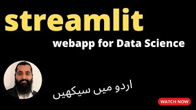](https://youtube.com/live/cLlFT3M-NPQ "Streamlit-14")


## **Day-37**
### **Time Series Analysis**

Is lecture main time series analysis ko dekhen gay.
Ye lecture two parts main hy.

1. Intro to Time Series Analysis

[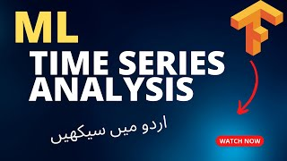](https://youtube.com/live/VgYCEhui6FE "Time series")

2. Advance Time Series Analysis

[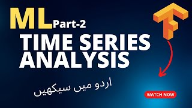](https://youtube.com/live/k4zP_EVJSP0 "Times series")


## **Day-38**
### **Introduction to NLP and text classification**


In this lecture we will learn about the basics of NLP and text classification.

HERE IS THE LECTURE:\
[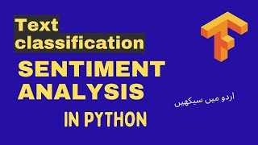](https://youtube.com/live/ytXo6nnPsSQ "NLP")

- Use of Tensorboad in Machine Learning

HERE IS THE LECTURE:\
[](https://youtube.com/live/EMPS8s8s4Hk "tensorboard")

## **Day-39**
### **github and git tools**

In this lecture we will learn about the github and git tools. Ap is main seekhen gay k kaisay github ko sue kar k ap apnay documentation save kar saktya hyn.

HERE IS THE LECTURE:\
[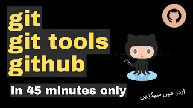](https://youtube.com/live/twuCzvsjno0 "github")

## **Day-40**
### **Use of chatGPT to maintain your social media accounts**


In this lecture we will learn about the use of chatGPT to maintain your social media accounts.

HERE IS THE LECTURE:\
[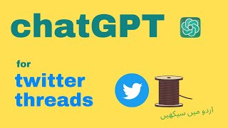](https://youtube.com/live/1WUM42VXQDo "chatGPT for SOcial Media")

--- 
## **Feedback**

Your feedback matters alot, may you please comment on the following [post on facebook](https://www.facebook.com/groups/codanics/permalink/1872283496462303/) to give use your feed back?

[](https://www.facebook.com/groups/codanics/permalink/1872283496462303/ "Feedback")

---

# Information about the instructor:

[](https://www.facebook.com/groups/codanics/permalink/1872283496462303/ "Image")

**Dr. Muhammad Aammar Tufail**

PhD Data Science in Agriculture\
[Youtube channel](https://www.youtube.com/channel/UCmNXJXWONLNF6bdftGY0Otw/)\
[Twitter](https://twitter.com/aammar_tufail)\
[Linkedin](https://www.linkedin.com/in/muhammad-aammar-tufail-02471213b/)
[github](https://github.com/AammarTufail)

contact: aammar@codanics.com

